# BuildingBox

A building‑expenses manager for a single building: track each apartment's monthly
dues (split **USD + LBP**, no conversion), record expenses, watch the money‑box balance,
and export a monthly owners' statement as a PDF.

Built with **Kotlin Multiplatform + Compose Multiplatform** (Android primary, Windows/macOS/Linux
desktop, iOS sources included) and **Firebase** (Email/Password auth, Realtime Database, Crashlytics).
Single Gradle module: `composeApp`. Clean‑architecture, feature‑based.

> **This repository is source code only — it contains NO secrets.**
> You bring your own **Firebase project** and **signing keystore**. They're supplied locally
> for development, or via **GitHub Actions secrets** for CI builds. Nothing secret is committed.

---

## Screenshots

<table>
  <tr>
    <td align="center">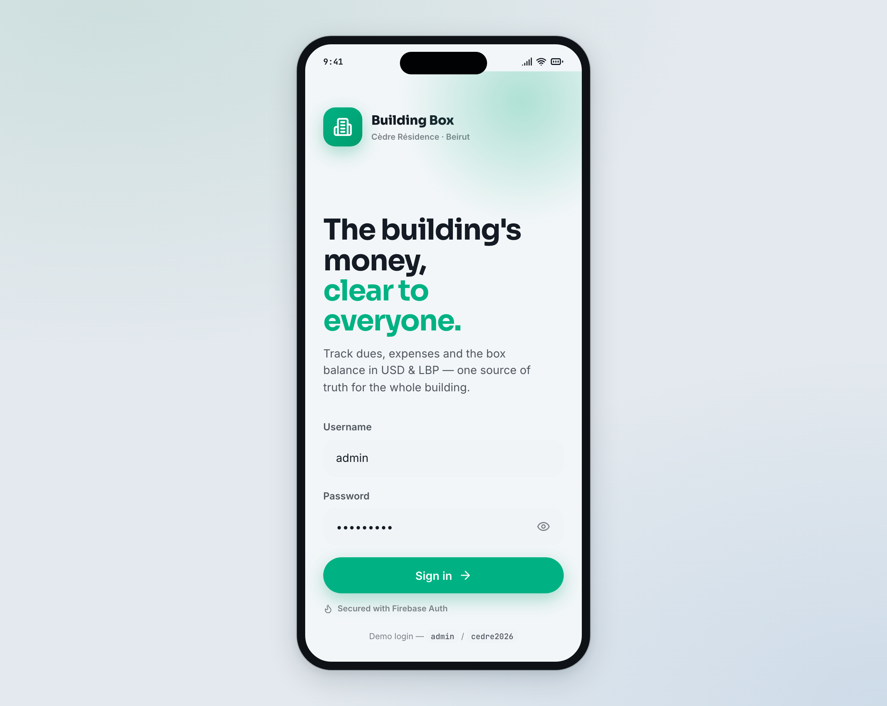<br/><sub><b>Login</b></sub></td>
    <td align="center">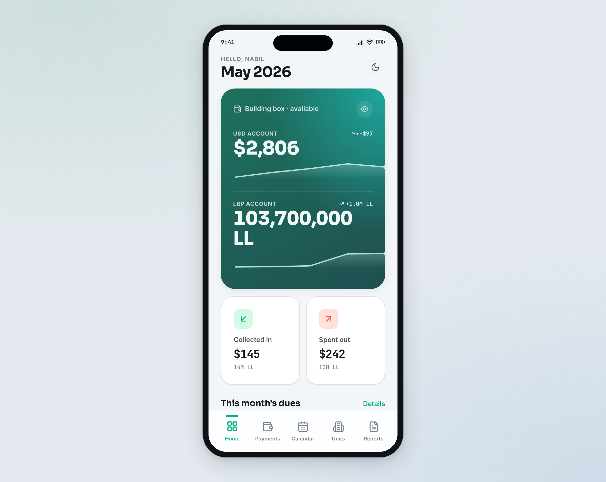<br/><sub><b>Home</b></sub></td>
    <td align="center">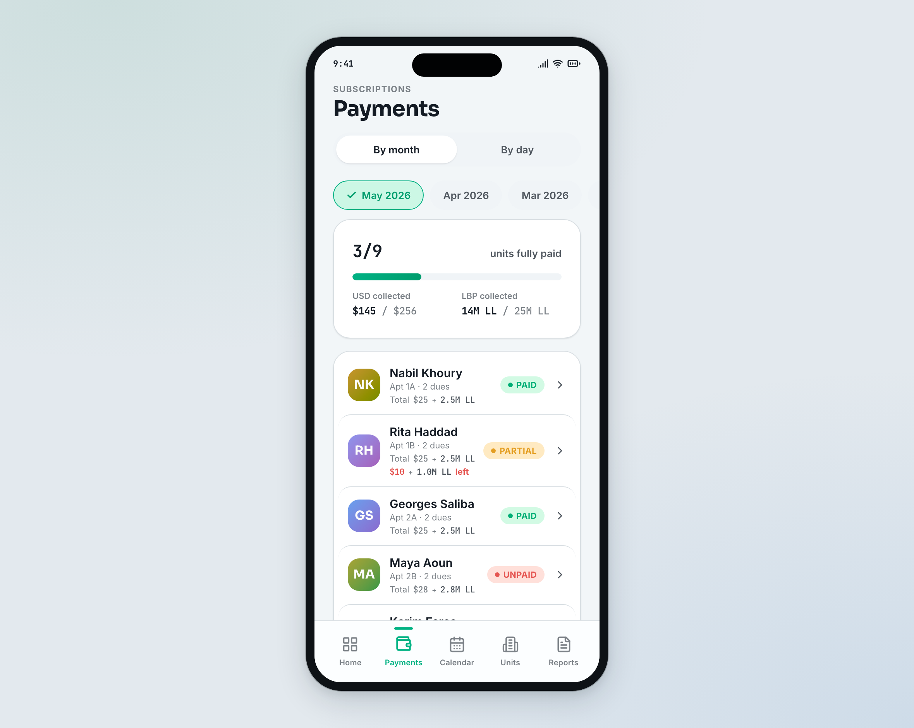<br/><sub><b>Payments</b></sub></td>
  </tr>
  <tr>
    <td align="center">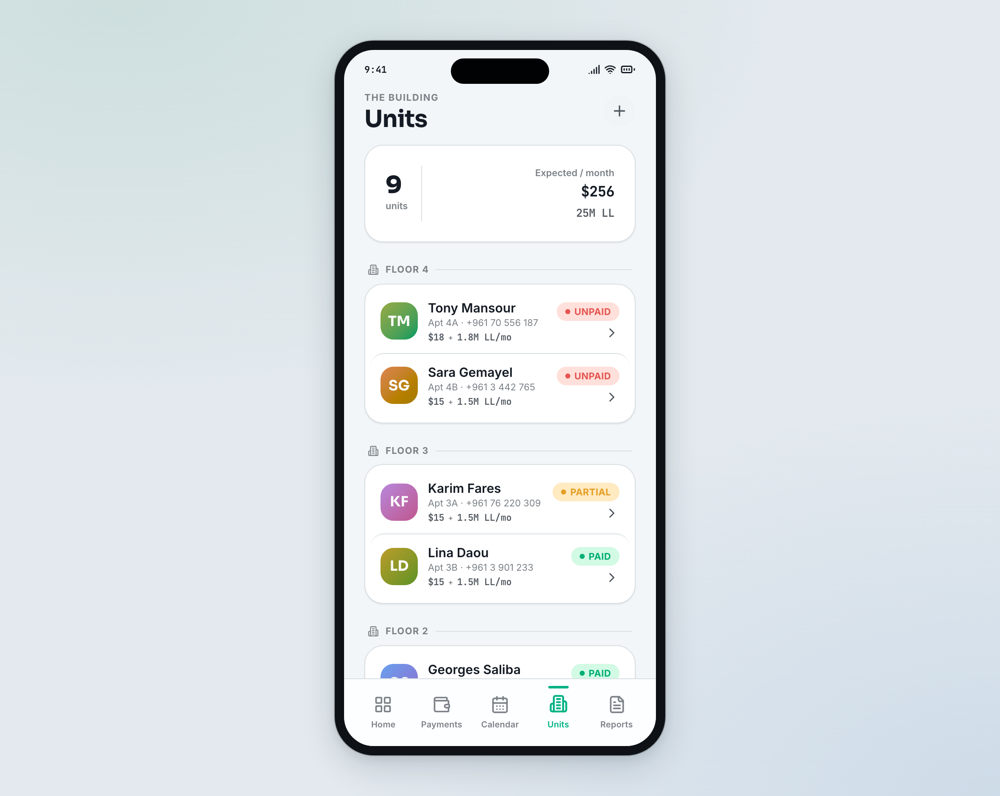<br/><sub><b>Apartments</b></sub></td>
    <td align="center">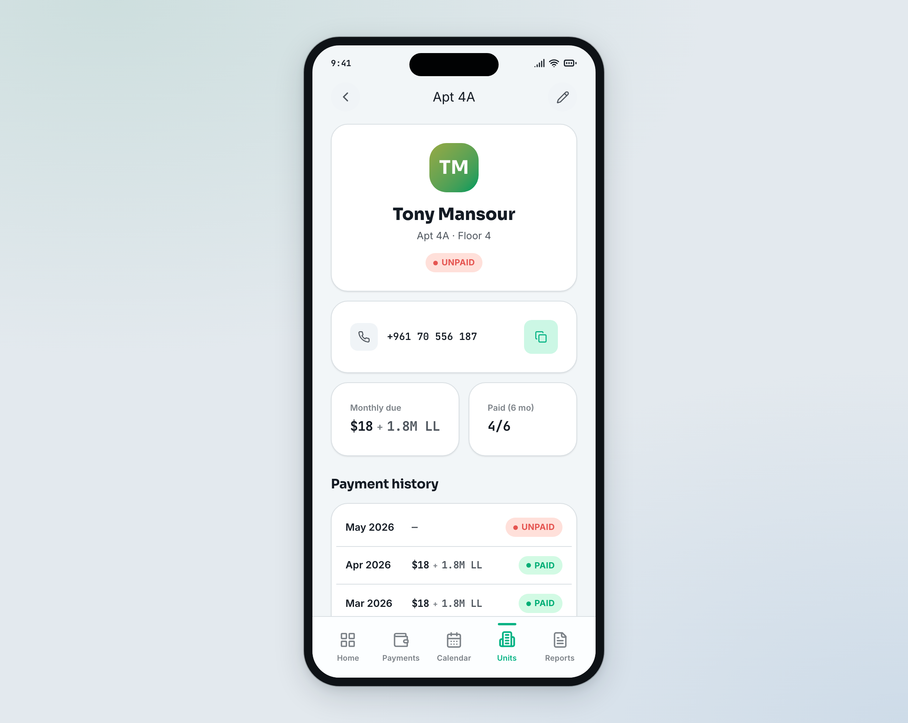<br/><sub><b>Apartment detail</b></sub></td>
    <td align="center">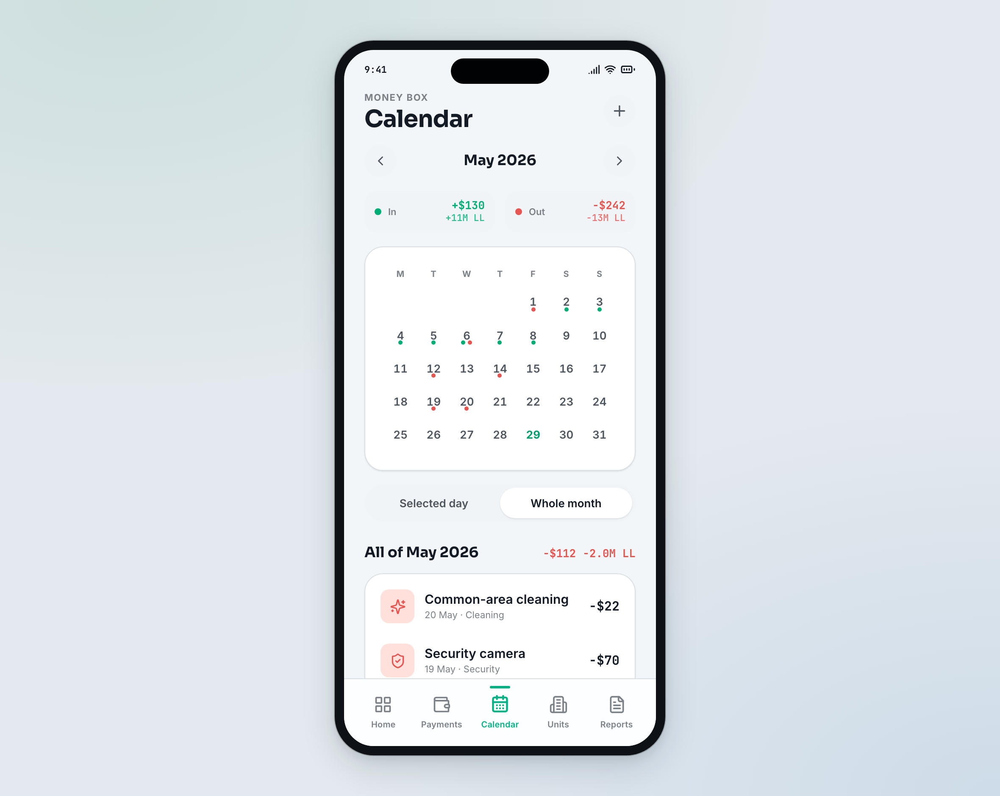<br/><sub><b>Calendar</b></sub></td>
  </tr>
  <tr>
    <td align="center">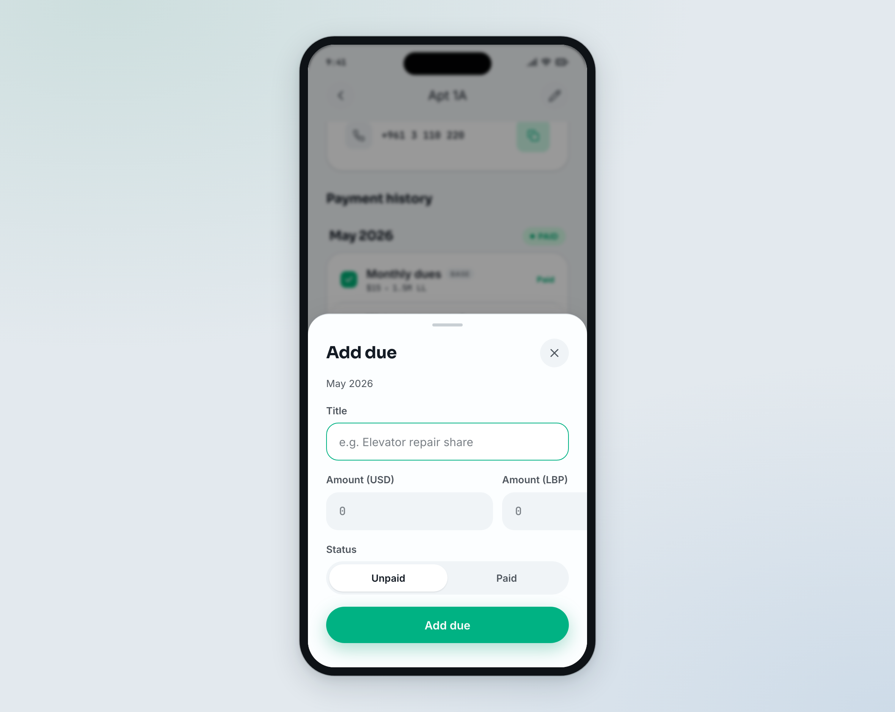<br/><sub><b>Add due</b></sub></td>
    <td align="center">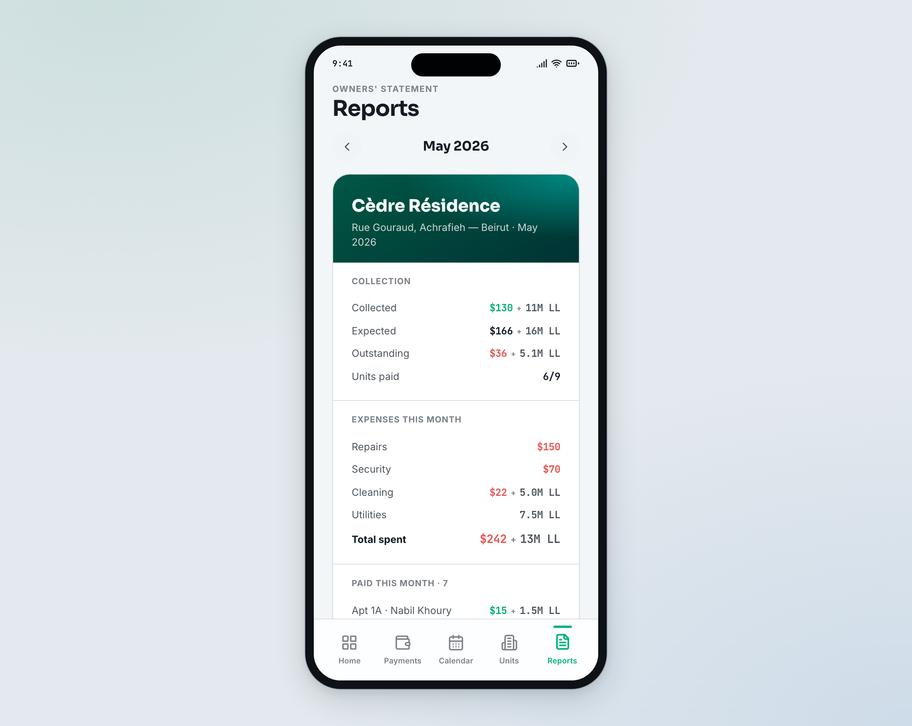<br/><sub><b>Reports</b></sub></td>
    <td align="center"></td>
  </tr>
</table>

**Dark theme**

<table>
  <tr>
    <td align="center">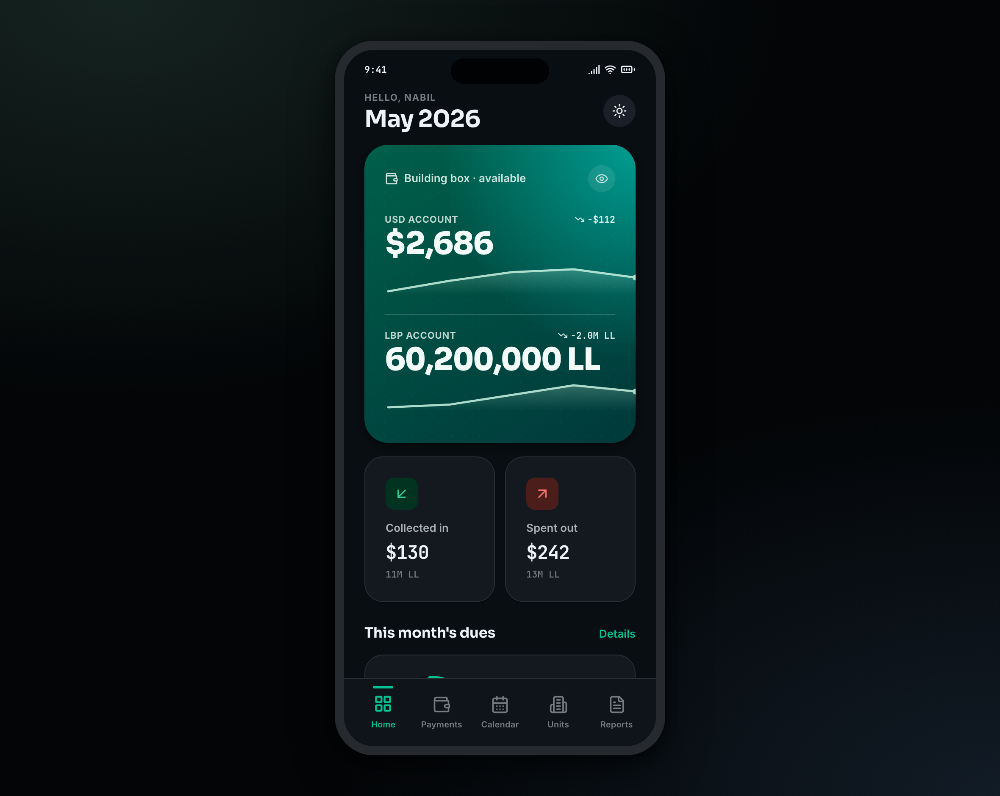<br/><sub><b>Home</b></sub></td>
    <td align="center">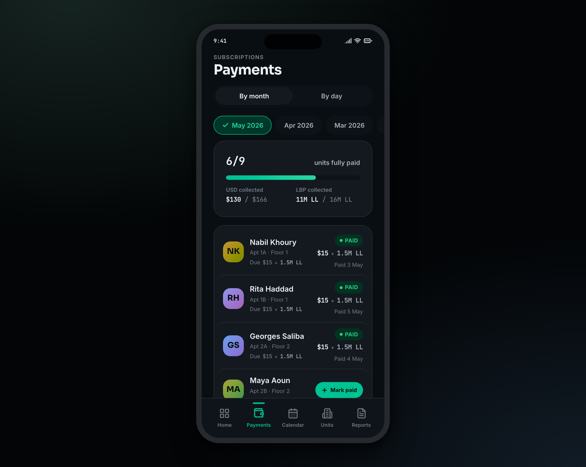<br/><sub><b>Payments</b></sub></td>
    <td align="center">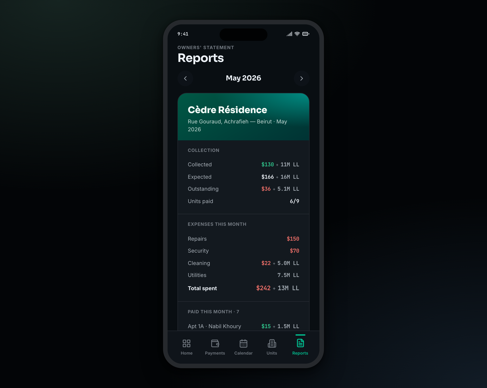<br/><sub><b>Reports</b></sub></td>
  </tr>
</table>

---

## Table of contents
1. [Prerequisites](#1-prerequisites)
2. [Get the code](#2-get-the-code)
3. [Firebase setup (required to run)](#3-firebase-setup-required-to-run)
4. [Signing keystore](#4-signing-keystore)
5. [Desktop config (optional)](#5-desktop-config-optional)
6. [Build & run locally](#6-build--run-locally)
7. [Build a signed APK locally](#7-build-a-signed-apk-locally)
8. [Build on GitHub Actions (optional)](#8-build-on-github-actions-optional)
9. [What is secret / what is committed](#9-what-is-secret--what-is-committed)
10. [Project structure](#10-project-structure)

---

## 1. Prerequisites

- **JDK 17** (Temurin recommended).
- **Android Studio** (latest) — or the command line + Android SDK (API 35, build‑tools 35).
- A **Google / Firebase account**.
- *(Optional)* **Firebase CLI** (`npm i -g firebase-tools`) to deploy database rules from the terminal.
- The desktop app needs nothing beyond JDK 17.

The Gradle wrapper (`./gradlew`) downloads the correct Gradle automatically.

---

## 2. Get the code

```bash
git clone <this-repo-url> buildingbox
cd buildingbox
```

The repo root **is** the app module root (it contains `gradlew`, `settings.gradle.kts`, `composeApp/`).

---

## 3. Firebase setup (required to run)

The app shows only the login screen until you connect a Firebase project and create an account.

### 3.1 Create the project & Android app
1. https://console.firebase.google.com → **Add project**.
2. **Add app → Android**, package name **`com.buildingbox.app`**.
3. Download **`google-services.json`** and place it at:
   ```
   composeApp/google-services.json
   ```
   (Gitignored — never commit it.)

### 3.2 Enable Email/Password + create your account
1. **Build → Authentication → Get started → Sign‑in method → Email/Password → Enable**.
2. **Authentication → Users → Add user** → your email + a password. *(The app has no sign‑up screen.)*
3. Copy your new user's **UID** (needed in 3.4).

### 3.3 Create the Realtime Database & deploy the rules
1. **Build → Realtime Database → Create database** (pick a region), start **locked**.
2. Deploy the security rules included in this repo (`firebase/database.rules.json`):
   ```bash
   cd firebase
   firebase login
   firebase use <your-project-id>
   firebase deploy --only database
   ```
   *(Or paste the contents of `firebase/database.rules.json` into Console → Realtime Database → Rules.)*

   The rules are **role‑based**: admins can write, everyone else is read‑only, default‑deny,
   and self‑signup can only create a `viewer` (no privilege escalation).

### 3.4 Become an admin
On first sign‑in the app self‑creates `/users/<uid>` as `viewer`. Promote yourself once:
- Console → **Realtime Database** → `users/<your-uid>/role` → set to **`admin`**.

After that, the add/edit/delete actions appear in the app.

### 3.5 (Optional) Crashlytics
**Release & Monitor → Crashlytics → Enable.** Wired by the Gradle plugins; no extra steps.

---

## 4. Signing keystore

A keystore signs release APKs.

### 4.1 Create one
```bash
keytool -genkeypair -v \
  -keystore composeApp/buildingbox.keystore \
  -alias buildingbox -keyalg RSA -keysize 2048 -validity 10000
```
Choose a store password, key alias (`buildingbox`), and key password when prompted.

### 4.2 Point Gradle at it
Create `keystore.properties` in the repo root (copy `keystore.properties.example`):
```properties
storeFile=buildingbox.keystore
storePassword=YOUR_STORE_PASSWORD
keyAlias=buildingbox
keyPassword=YOUR_KEY_PASSWORD
```
`storeFile` is resolved **relative to the `composeApp/` module**. Both `keystore.properties`
and `*.keystore` are gitignored.

> Without `keystore.properties`, debug builds still work (Android falls back to the default
> debug key); release signing needs it.

---

## 5. Desktop config (optional)

The desktop app can't read `google-services.json`; it talks to Firebase over REST.
Copy `config/desktop-firebase.example.properties` to `composeApp/desktop-firebase.properties`:
```properties
firebase.apiKey=YOUR_WEB_API_KEY            # Console → Project settings → General → Web API Key
firebase.databaseUrl=https://<id>-default-rtdb.<region>.firebasedatabase.app
firebase.projectId=<your-project-id>
```
(Gitignored.)

---

## 6. Build & run locally

**Android (recommended — Android Studio):** open the repo root, let it sync, run the `composeApp` configuration on a device/emulator.

**Android (CLI):**
```bash
./gradlew :composeApp:assembleDebug
adb install -r composeApp/build/outputs/apk/debug/composeApp-debug.apk
```

**Desktop:**
```bash
./gradlew :composeApp:run
```

**Desktop installer (Windows .msi / macOS .dmg / Linux .deb):**
```bash
./gradlew :composeApp:packageDistributionForCurrentOS
```

> First sign‑in: use the email/password from §3.2, then promote your UID to `admin` (§3.4).

---

## 7. Build a signed APK locally

With `keystore.properties` (§4) in place:
```bash
./gradlew :composeApp:assembleRelease
# → composeApp/build/outputs/apk/release/composeApp-release.apk  (signed)
```
Verify the signer:
```bash
"$ANDROID_HOME/build-tools/35.0.0/apksigner" verify --print-certs \
  composeApp/build/outputs/apk/release/composeApp-release.apk
```

---

## 8. Build on GitHub Actions (optional)

The workflow `.github/workflows/build.yml` recreates the secret files from **repository
secrets**, then builds two things and uploads them as run artifacts — no secret lives in the repo:
- **`android` job** (ubuntu) → signed release **APK**.
- **`desktop` job** (matrix) → native installers: **`.msi`/`.exe`** on Windows, **`.dmg`** on macOS, **`.deb`** on Linux.

It runs on **pull requests to `main`** and can be triggered manually
(**Actions → Build apps → Run workflow**).

Add these secrets in **Settings → Secrets and variables → Actions → New repository secret:**

| Secret name | Value |
|---|---|
| `GOOGLE_SERVICES_JSON_BASE64` | base64 of your `composeApp/google-services.json` |
| `KEYSTORE_BASE64` | base64 of your `buildingbox.keystore` |
| `KEYSTORE_STORE_PASSWORD` | keystore store password |
| `KEYSTORE_KEY_ALIAS` | key alias (e.g. `buildingbox`) |
| `KEYSTORE_KEY_PASSWORD` | key password |

Generate the base64 values:
```bash
# macOS
base64 -i composeApp/google-services.json | pbcopy   # → GOOGLE_SERVICES_JSON_BASE64
base64 -i composeApp/buildingbox.keystore  | pbcopy   # → KEYSTORE_BASE64

# Linux
base64 -w0 composeApp/google-services.json
base64 -w0 composeApp/buildingbox.keystore
```

The **desktop** job needs none of the keystore secrets; it only uses `GOOGLE_SERVICES_JSON_BASE64`
(optional — restored just to keep the Firebase Gradle plugin happy) and signs nothing. The desktop
app reads its own `desktop-firebase.properties` at runtime, not at build time, so that file isn't
needed to produce the installers.

Download results from **Actions → (the run) → Artifacts** (`BuildingBox-android-…`,
`BuildingBox-desktop-windows-…`, etc.). On a **public** repo anyone can download a run's artifacts;
on a **private** repo only users with repo access can. Each job deletes the recreated secret files
at the end.

---

## 9. What is secret / what is committed

**Never committed (gitignored):**
- `composeApp/google-services.json`, `**/GoogleService-Info.plist`, `composeApp/desktop-firebase.properties`
- `keystore.properties`, `*.keystore`, `*.jks`, `*.p12`
- `local.properties`, `.env*`, `build/`, `.gradle/`

**Safe to commit (no secrets):**
- All source code, `firebase/database.rules.json`, `keystore.properties.example`,
  `config/desktop-firebase.example.properties`, the GitHub Actions workflow.

Before pushing, sanity‑check nothing secret is staged:
```bash
git status --porcelain | grep -iE 'google-services|keystore|\.jks|desktop-firebase|GoogleService-Info' && echo "SECRET STAGED — STOP" || echo "clean"
```

---

## 10. Project structure

```
composeApp/
  src/commonMain/kotlin/com/buildingbox/app/
    app/                     responsive shell + bottom nav / rail
    core/{designsystem,money,datetime,firebase}
    feature/{auth,dashboard,units,payments,calendar,reports}/{domain,data,presentation}
  src/androidMain/           Android entry, Firebase (GitLive) + Crashlytics, PDF export
  src/desktopMain/           Desktop entry, Firebase via Ktor REST
  src/iosMain/               iOS sources (GitLive) — not built here
  src/commonMain/composeResources/font/   Sora · Inter · JetBrains Mono
firebase/                    database.rules.json + firebase.json
.github/workflows/build.yml  CI: signed APK + desktop installers (secrets → artifacts)
keystore.properties.example  signing template (copy to keystore.properties)
config/                      example config templates
```

- **Money** is stored as integers (`usdCents`, `lbp`) — never converted between currencies.
- **Realtime Database** is month‑sharded (`dues/$month`, `expenses/$month`) for small, fast reads.
- **Roles**: `admin` (full control) vs `viewer` (read‑only), enforced in the UI *and* the DB rules.
